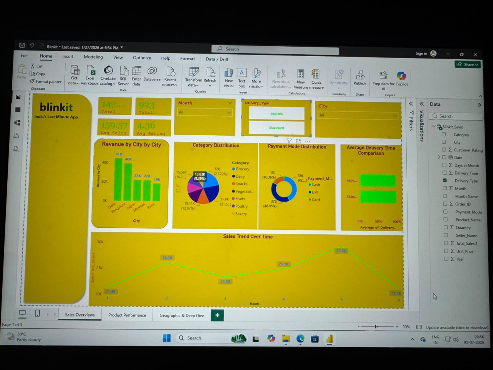
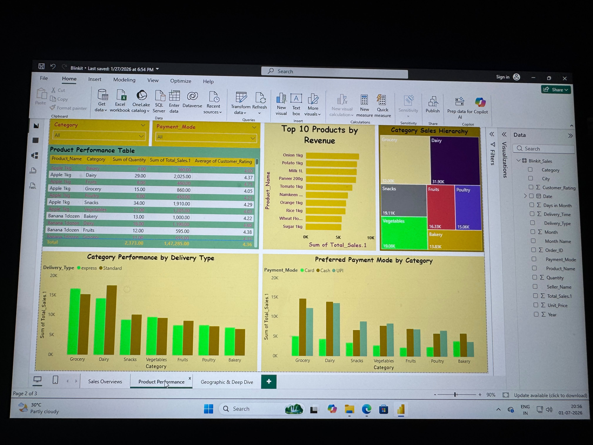
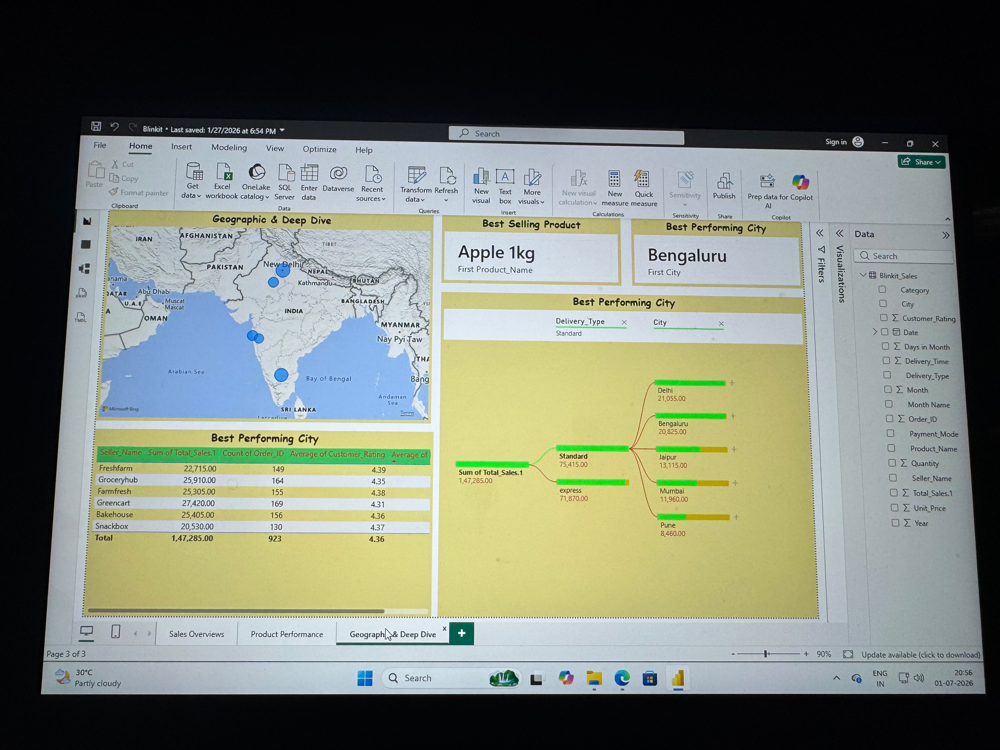
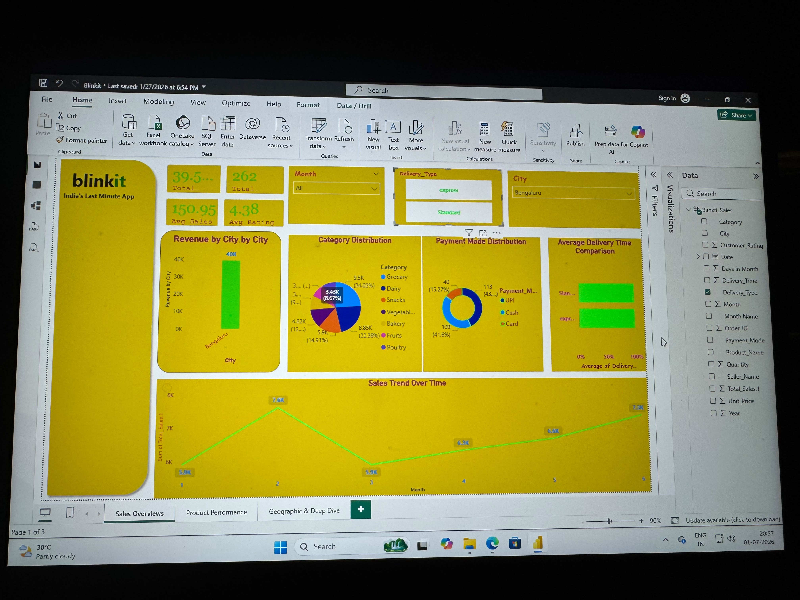

# 📊 Blinkit Sales Dashboard (Power BI Project)

## 🚀 Project Highlights

- Designed a fully interactive multi-page Power BI dashboard.
- Cleaned and transformed raw sales data using Power Query.
- Created reusable DAX measures for business KPIs and performance tracking.
- Developed dynamic filters for month, city, and delivery type analysis.
- Built interactive visualizations for sales, products, geography, and customer behavior.
- Identified key business trends and generated actionable recommendations.
- Applied data storytelling techniques to present insights in a clear and business-friendly manner.

---

## 🧠 Project Overview
This project is an interactive Power BI dashboard built to analyze Blinkit sales data. It provides insights into sales performance, product categories, outlet analysis, and geographical trends.

The goal of this project is to convert raw sales data into meaningful business insights for decision-making.

---

## 🎯 Objective
To build an interactive Power BI dashboard that analyzes Blinkit sales performance across outlets, product categories, and regions to generate actionable business insights for decision-making.

---

## 📌 Key Business Questions

- Which cities contribute the highest revenue to Blinkit's overall sales?
- Which product categories generate the maximum sales and customer demand?
- What are the monthly sales trends, and are there any seasonal patterns?
- Which payment methods are most preferred by customers?
- How does delivery type (Standard vs Express) impact sales performance?
- Which products contribute the highest revenue?
- Which sellers consistently achieve the best sales performance?
- How do customer ratings vary across products and sellers?
- Which categories perform well across different delivery methods?
- What business opportunities can be identified to improve sales and customer experience?

---

## 📊 Dashboard Pages
- Sales Overview
- Product Performance
- Geographic Analysis
- Deep Dive Analysis

---

## 🛠 Tools Used
- Power BI
- Power Query
- DAX (Data Analysis Expressions)
- Excel (Dataset)

---

## 🧮 DAX Measures (Business Logic)

This dashboard uses DAX to calculate key business KPIs for analysis.

### Core Measures:
- Total Sales = SUM(Sales[SalesAmount])
- Average Sales = AVERAGE(Sales[SalesAmount])
- Total Items Sold = COUNT(Sales[ItemID])
- Average Rating = AVERAGE(Sales[Rating])

### Business KPIs Derived:
- Sales Contribution % by Outlet Type
- Category-wise Sales Performance
- Outlet Performance Ranking

---

## ⚙️ Key Highlights
- End-to-end data analytics workflow
- Data cleaning using Power Query
- KPI creation using DAX
- Multi-page interactive dashboard
- Business insights generation

---

## 📸 Dashboard Preview

### Sales Overview

### Product Performance

### Geographic Analysis

### Filters View

---

## 📊 Business Insights

- Bengaluru emerged as the highest revenue-generating city, contributing approximately ₹40K in sales, making it the strongest performing market.

- Total sales reached approximately ₹147K across 923 orders, with an average order value of ₹159.57 and an average customer rating of 4.36, indicating consistent customer satisfaction.

- Grocery and Dairy categories generated the highest revenue among all product categories, while Bakery contributed the lowest share of total sales.

- Apple 1kg was identified as the best-selling product, making it a key revenue-driving SKU.

- UPI and Cash were the most preferred payment methods, together accounting for the majority of customer transactions.

- Sales showed noticeable monthly fluctuations, with the highest sales recorded in Month 5 and a decline observed in Month 6, indicating possible seasonal demand patterns.

- Standard delivery contributed significantly more revenue than Express delivery, suggesting customers preferred the regular delivery option.

- Freshfarm recorded the highest seller revenue among all sellers, while customer ratings remained consistently above 4.3 across major sellers, reflecting stable service quality.

- Product category performance varied by delivery type, with Grocery and Dairy maintaining strong sales across both Standard and Express deliveries.

- Geographic analysis highlighted Bengaluru as the top-performing city, followed by Delhi and Jaipur, providing clear opportunities for region-specific marketing and inventory planning.

---

## 💡 Business Recommendations

- Increase inventory availability for Grocery and Dairy products to meet high customer demand.
- Expand marketing campaigns in Bengaluru and other top-performing cities to maximize revenue.
- Investigate the sales decline in Month 6 and identify potential seasonal or operational factors.
- Encourage digital payment adoption by offering incentives on UPI transactions.
- Improve sales performance of lower-performing categories such as Bakery through promotional offers and bundled discounts.

## 👨‍💻 About This Project

This project demonstrates an end-to-end Business Intelligence workflow using Power BI. Starting from raw sales data, I performed data cleaning and transformation using Power Query, built analytical measures with DAX, and designed an interactive dashboard to uncover meaningful business insights.

The dashboard enables users to monitor sales performance, evaluate product and seller performance, analyze regional trends, understand customer purchasing behavior, and support data-driven business decisions through interactive visualizations and KPIs.
